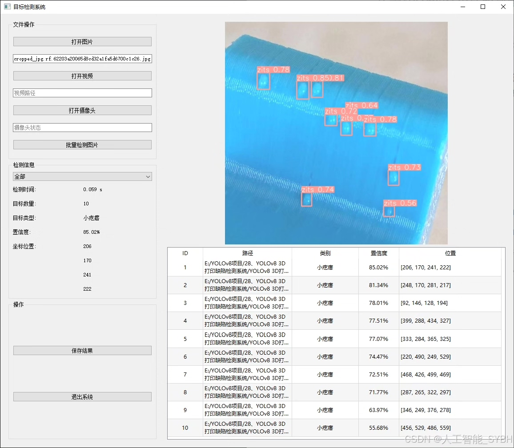
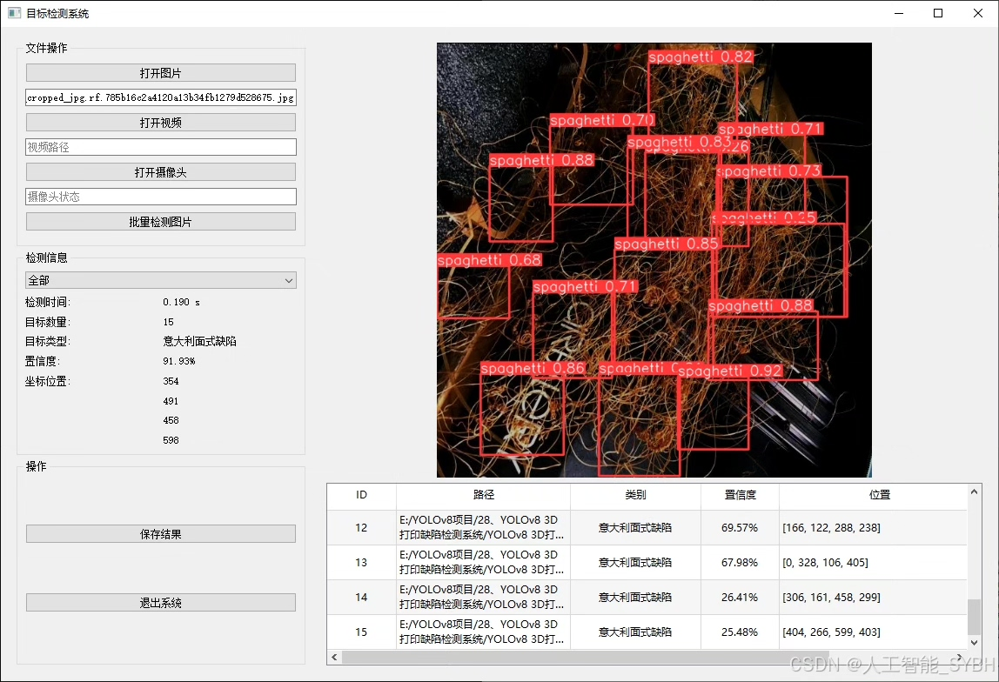
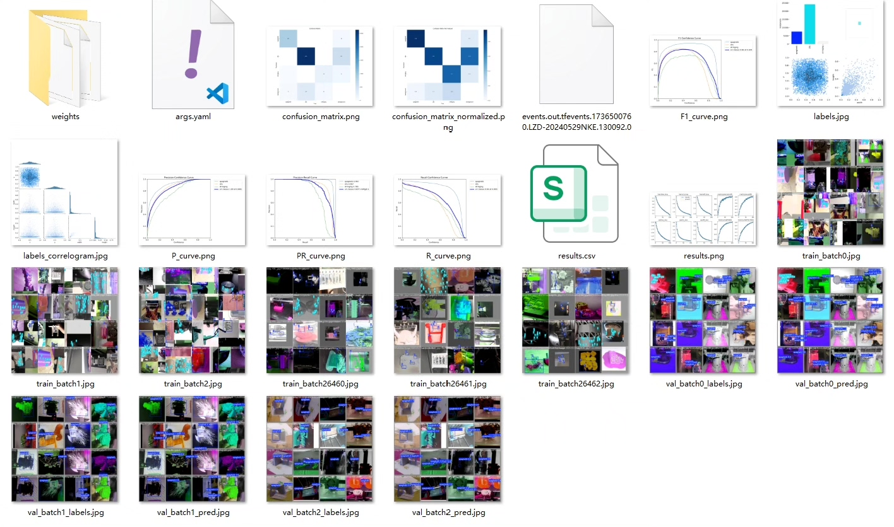
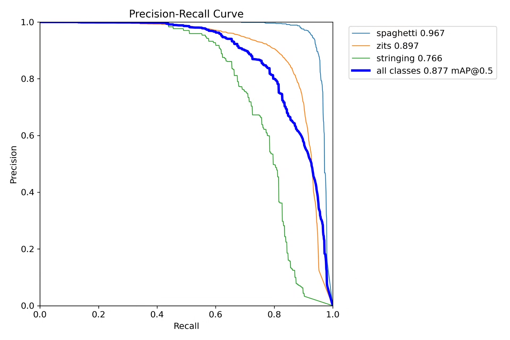
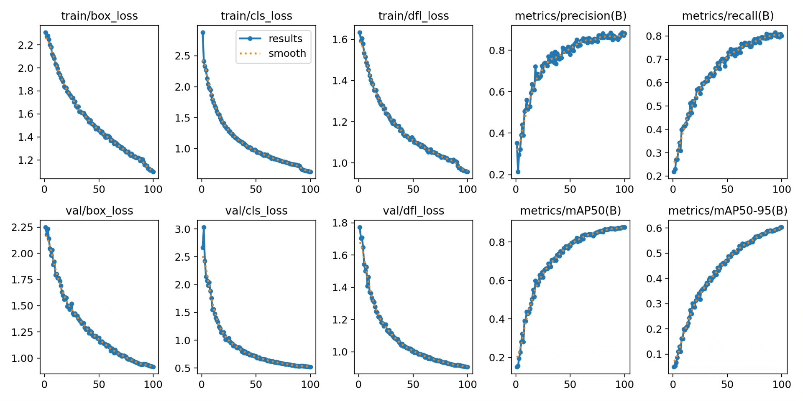
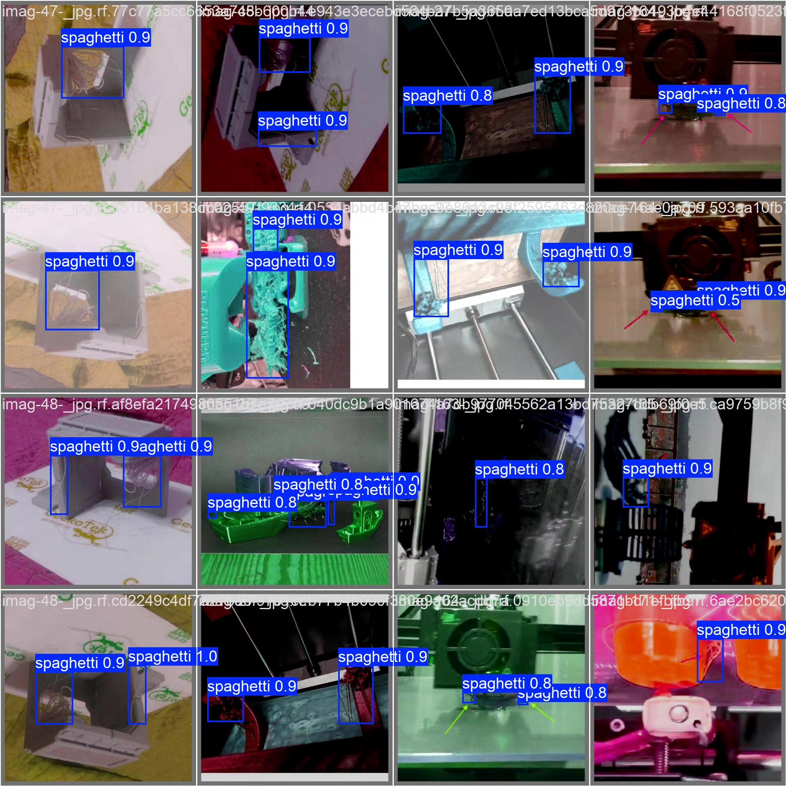
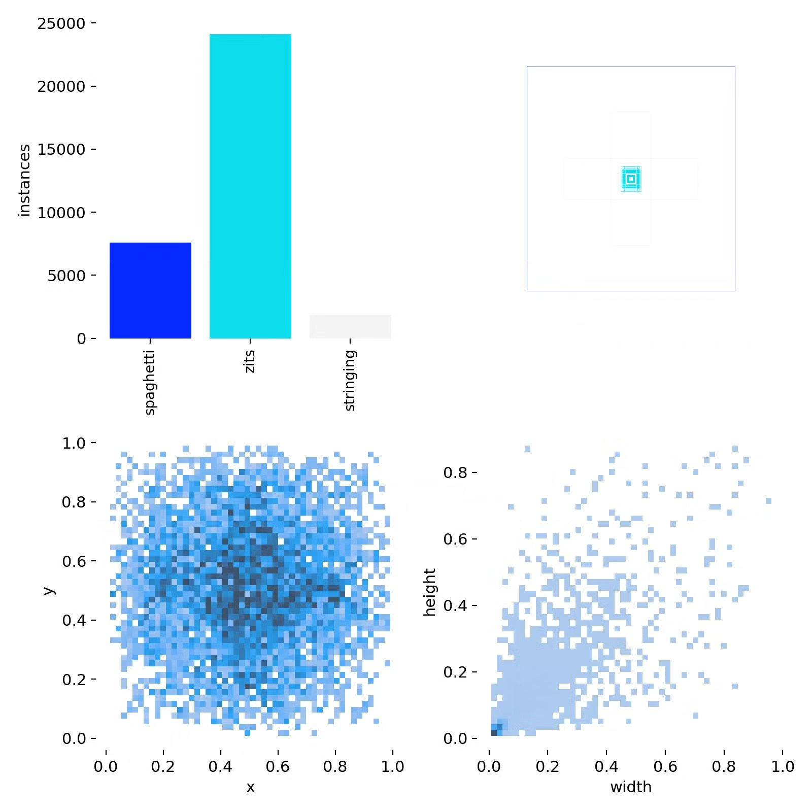
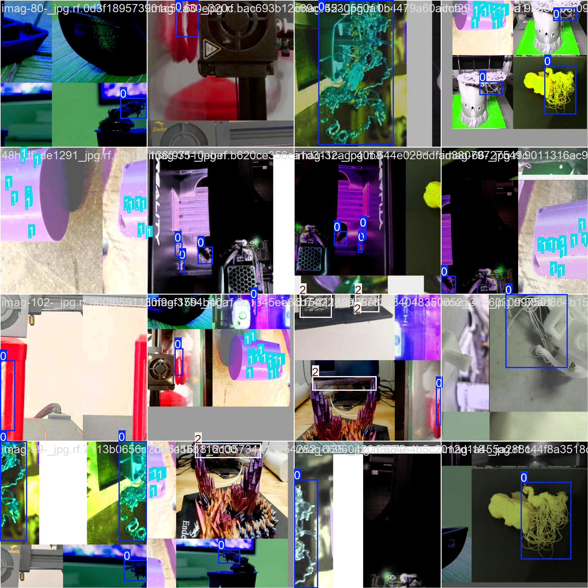

# 3D printing defect detection system based on YOLOv8 deep learning

## Body

Based on the YOLOv8 deep learning framework, this project has developed a smart visual system specifically for 3D printing quality inspection. The system can accurately identify and classify three common 3D printing defects: spaghetti (clumped filament defects), zits (surface bump defects), and stringing (ribbon defects). Through training with 5870 high-quality labeled images (4696 training set, 587 validation set, and 587 test set), the model has achieved precise detection of minute print defects.

The company's products have been granted YOLO official commercial license certification.

We offer after-sales service.

After payment, we will provide a WeChat account for any questions.

Environment configuration: We will provide an environment configuration tutorial, and WeChat will provide answers to questions.

Remote installation service: If you need remote configuration, an additional fee of 69 is required,

If the configuration fails, all fees are refunded (specially for old computers only refund installation fees)

Retraining dataset: After setting up the environment, you can train on your own computer.
If you need us to retrain, just pay 69 + computing power fees (2.5 yuan/hour)

Full after-sales service

## Images

## Payment

Here is a pay link on Stripe ( https://buy.stripe.com/3cs8yP7sY87d0vu9AB ). Please contact me lonlonago@foxmail.com after funding $89, and I will send you a complete data files , thank you!

